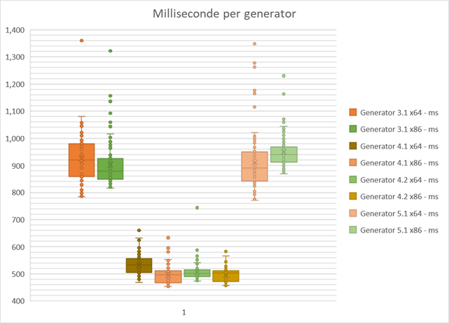

# Performance tests

## Setup

Tested on a PC with the following specs:

* Intel I7-7700K CPU @ 4.20 Ghz
* Ram 48.0 GB, Speed 2400 Mhz
* 100 Tests
* 1.000.000 UUID Amount

## Benchmark Code

Each test has been done with the following code:

```csharp
public static void Test(Int32 Version, Int32 Variant, Int32 TestCount = 100, Int32 Count = 1000000) {
    Stopwatch stopwatch = new Stopwatch();

    for (Int32 I = 0; I < TestCount; I++) {
        stopwatch.Start();

        UUID[] Temp = UUIDFactory.CreateUUIDs(Count, Version, Variant);

        stopwatch.Stop();

        Temp = null;
        GC.Collect(GC.MaxGeneration, GCCollectionMode.Default, true);
        Console.Title = $"V{Version}.{Variant}\t-\t{I}/{TestCount}";
    }

    Console.WriteLine($"=== Version {Version}\tVariant {Variant} ===");
    Output(stopwatch, Version, Variant, TestCount, Count);
}
```

## Results

|Platform|Version |Variant |milli seconds per test |ticks per test |
|--------|--------|--------|---|---|
|x64 |3 |1 |925.57|9255725.31|
|x86 |3 |1 |902.71|9027142.91|
|x64 |4 |1 |533.32|5333294.43|
|x86 |4 |1 |495.67|4956702.14|
|x64 |4 |2 |506.01|5060131.24|
|x86 |4 |2 |494.99|4949900.86|
|x64 |5 |1 |910.46|9104612.2|
|x86 |5 |1 |950.05|9500552.11|

### Distribution Graph



